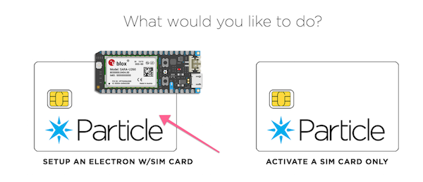
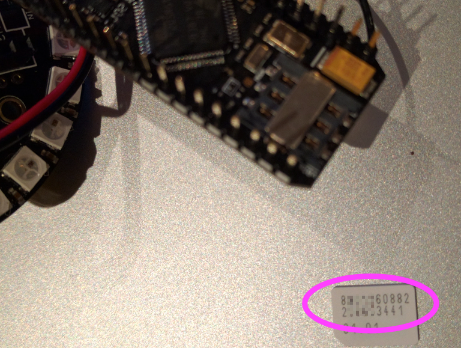
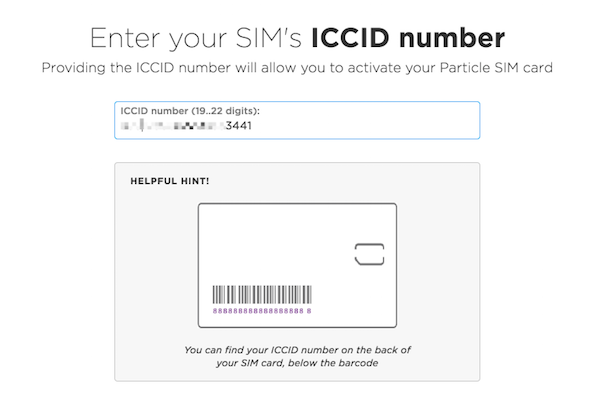
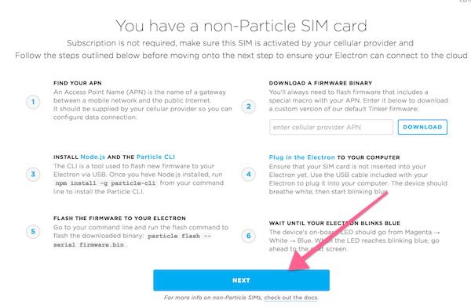
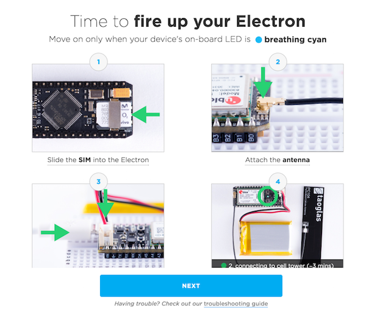
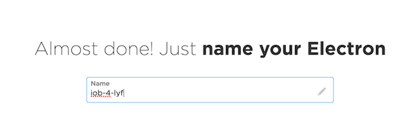
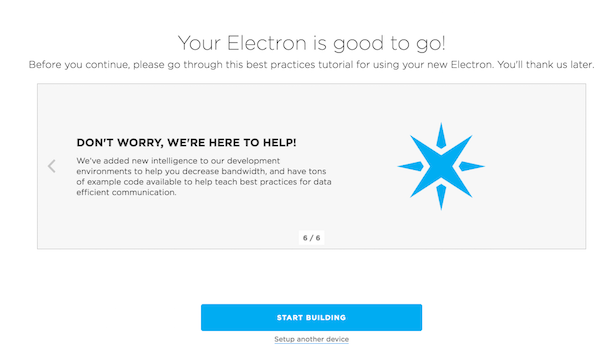

# The Internet of Bling (SIGNAL 2016)

It looks like you've found yourself an Internet of Bling device, just like those demo'd during the opening keynote of SIGNAL 2016. 

Great news! But what now? 

Read on to learn more about the Internet of Bling - the world's first (afawk) programmable bling platform. This README will show you how to claim the included Twilio SIM card to your Twilio account, how to claim the included Particle Electron to your Particle account, and how to deploy your first ~~IoT~~ IoB app. 

If you're already a Particle expert, please feel free to jump to the last section of this doc.

## What is the Internet of Bling? 

A question as old as time. Your Internet of Bling device consists of: 

 * A [Particle Electron 3G cellular IoT board](https://store.particle.io/collections/electron).
 * An [Adafruit Particle Neopixel ring](https://www.adafruit.com/product/2268).
 * A [Twilio SIM card](https://www.twilio.com/wireless) and associated connectivity.

## What can the IoB do for me?

The possibilities are limitless! So long as they involve being connected to the Internet, sending and receiving SMS, and programmatically illuminating multiple RGB LEDs in any combination you can imagine!

For example, you could have your IoB display a pattern whenever someone tweets at you.  Or turn red whenever someone posts to your company's `#outage` slack channel (as if that ever happens). For these cases and more, Particle provides simple integration to [IFTTT](https://www.particle.io/ifttt).

Of course, the Electron isn't limited to talking to the Neopixel light ring. Add more sensors and actuators as you wish. 

## Take control of your Twilio SIM

In order to use the new `Devices` and `Commands` APIs as part of Twilio Programmable Wireless, you need a Twilio SIM card associated with *your own* Twilio account. The SIM card currently in your IoB will do fine. Take it to a Twilio employee at the Hackpack Station. They will: 

* Disassociate the SIM from the demo account it's currently on. 
* Provide instructions for you to add the SIM to your own account using the [console](/console/wireless).

## Take control of your Particle Electron

Particle provides a phenomenal web-based device management and code editing environment. To use it, we must first associate our Electron device with our Particle account.

Claiming an Electron with a Twilio developer preview SIM card is slightly different from the normal flow, so we'll take some time to walk through it here. At the end of this process you'll be able to author code in the web-based Particle Build IDE and deploy to your device over-the-air.

### Step 0. 
Start by signing up for a Particle account [here](https://build.particle.io/signup).

Next, visit https://setup.particle.io/ and sign in if required.

#### Step 1: Click "Set up an Electron w/ SIM Card":


#### Step 2: Physically remove the SIM card from your Internet of Bling Electron:


#### Step 3: Enter the ICCID from the back of the SIM card into the Particle on-boarding flow:


#### Step 4: Ignore the steps described on the screen below. Just hit 'Next'. Your Electron is already running a Twilio-compatible firmware:


#### Step 5: Hit 'Next' when prompted:


#### Step 6: Give your Electron a name:


#### Step 7: Click 'Start Building':



## Pick up your included accessories: breadboard, full-size antenna, USB charger and more. 
The standard accessories that ship with a Particle Electron are waiting for you at the Information Desk, downstairs in the Cruise Ship Terminal at SIGNAL 2016. Just tell a Twilio employee that you're there to collect the accessories for your Internet of Bling Electron.

## Deploy your first app
Deploy your first app over-the-air from [Particle Build](https://build.particle.io). For more example code designed to work with the Neopixel ring, check out the [Neopixel sample library](https://build.particle.io/libs/5689c7e20ae26f19c80016be). 

_Whatever you build, be sure to see the notes below before flashing a new firmware over-the-air._

## Some special notes about your Particle

The firmware running on your Internet of Bling device has added awesomeness, which makes it slightly non-standard.

### APN Settings
Your Electron is configured to use Twilio developer preview SIM cards. That requires setting the device's APN to `wireless.twilio.com`. If you leave out this particular configuration statement, your Electron won't be able to get back online, and you won't be able to reupdate it over-the-air. So be sure to include it! 

```
/* Set up Twilio APN - required with Twilio SIM */
STARTUP(cellular_credentials_set("wireless.twilio.com", "", "", NULL));
```

See [application.ino](application.ino#L11) for an example. 

### Electron firmware version 0.5.1-rc2

The other special thing about your Electron is that it's running a pre-release base firmware provided by Particle. This shouldn't affect your usage of the platform, but it may be useful to know. 

```
https://github.com/spark/firmware/releases/tag/v0.5.1-rc.2
```


